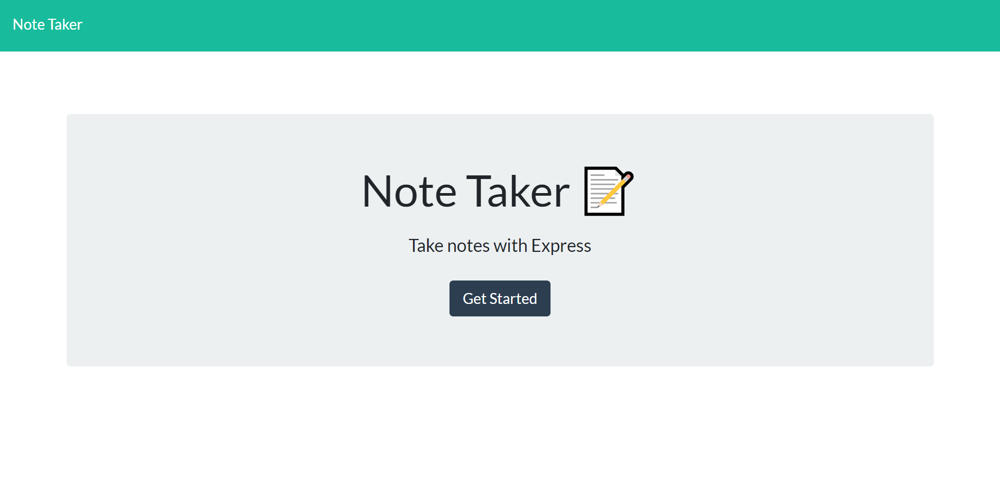
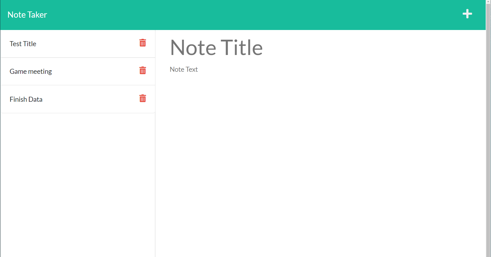
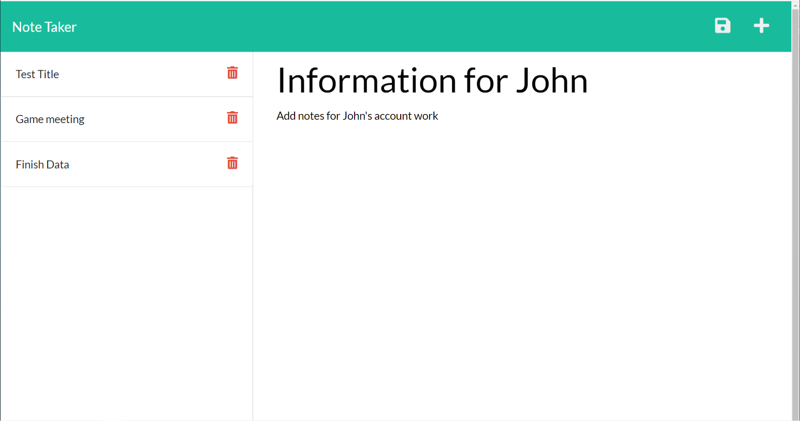

# Bk_Note_Taker

 Bk_Note_Taker is a note-taking application that when launched opens a page that shows all previous entered notes and allow the user to enter new notes.
 ##
 When the user clicks the "Get Started" menu he is taken to the note page that displays all entered notes on the left side column and an editor section on the right side column.
##
On the left panel, if the users clicks on a title he is presented with information from the notes entered for that title on the right panel or column
On the left panel, the user is also given the option to delete a given note by clicking on the delete button.
##
On the right panel when the user clicks on the Write icon in the navigation at the top of the page he is presented with empty fields to enter a new note title and the note’s text in the right hand column.
A save button that appears on the navigation bar after user start entering the text allows the user to save the note entered, by clicking on it.
##
Github Link Repo Link :https://github.com/bkoala/Bk_Note_Taker

## Here are screenshots for the application
Application Start Screenshot :
Application Screenshot Notes :
Application Screenshot Save  :